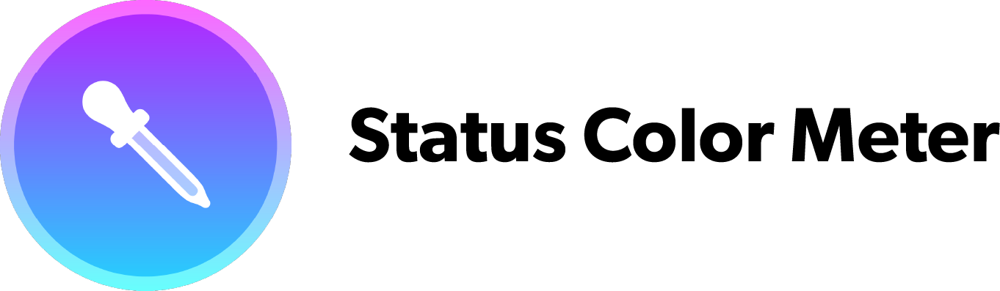
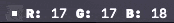

<h1 align="center">Status Color Meter</h1>

DigitalColorMeter for the menu bar

## Features
* 🖌 Pixel perfect color sampling
* 🎨 5 color spaces
* 🖼 Preview of surrounding pixels

## Technologies
This app was built using `SwiftUI`, Apple's new UI framework for macOS, iOS, watchOS, and tvOS.

## Installation
You can get it from the AppStore to support my development, or compile from source.
> Note: The app requires macOS 10.15, as it is built using SwiftUI
