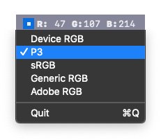

<h1 align="center">Status Color Meter</h1>

DigitalColorMeter for the status bar

## Features
* 🎨 Pixel perfect color sampling
* ❺ color spaces
* 🖼 Preview of surrounding pixels

## Technologies
This app was built using `SwiftUI`, Apple's new UI framework for macOS, iOS, watchOS, and tvOS.
